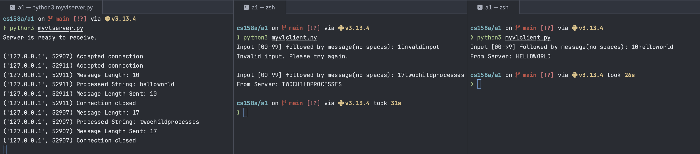

# a1: varlen

### Execution

In separate terminals, run the following commands:

- first terminal:

```
python3 myvlserver.py
```

- nth terminal:

```
python3 myvlclient.py
```

in client terminals, input a 2 digit number followed by a string (no space)

### Results



- values are regex checked
- server can handle multiple clients concurrently
